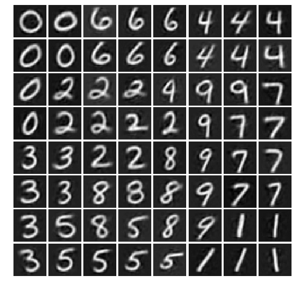
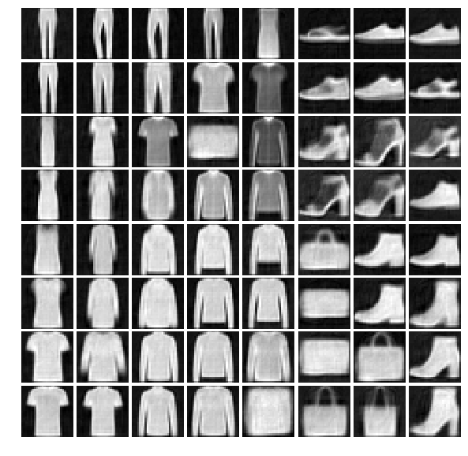

# DESOM: Deep Embedded Self-Organizing Map 

This is the official Keras implementation of the **Deep Embedded Self-Organizing Map (DESOM)** model.

DESOM is an unsupervised learning model that jointly learns representations and the code vectors of a self-organizing map (SOM) in order to survey, cluster and visualize large, high-dimensional datasets. Our model is composed of an autoencoder and a custom SOM layer that are optimized in a joint training procedure, motivated by the idea that the SOM prior could help learning SOM-friendly representations. Its training is fast, end-to-end and requires no pre-training.



When using this code, please cite following works:

> Forest, Florent, Mustapha Lebbah, Hanene Azzag and Jérôme Lacaille (2019). Deep Embedded SOM: Joint Representation Learning and Self-Organization. In European Symposium on Artificial Neural Networks, Computational Intelligence and Machine Learning (ESANN 2019).

> Forest, Florent, Mustapha Lebbah, Hanene Azzag and Jérôme Lacaille (2019). Deep Architectures for Joint Clustering and Visualization with Self-Organizing Maps. In Workshop on Learning Data Representations for Clustering (LDRC), PAKDD 2019.

> Forest, Florent, Mustapha Lebbah, Hanene Azzag, and Jérôme Lacaille (2021). Deep Embedded Self-Organizing Maps for Joint Representation Learning and Topology-Preserving Clustering. Neural Computing and Applications 33, no. 24 (December 1, 2021): 17439–69. https://doi.org/10.1007/s00521-021-06331-w.

(see also http://florentfo.rest/publications)

## Quick start

The implementation is divided into several scripts:

* *train.py*: main training script.
* *DESOM.py*: DESOM model class.
* *ConvDESOM.py*: Convolutional DESOM model class.
* *SOM.py*: SOM layer class.
* *AE.py*: autoencoder models (mlp and conv2d).
* *Kerasom.py*: a standard SOM in Keras, without the autoencoder part.
* *datasets.py*: script for loading the datasets benchmarked in the paper (MNIST, Fashion-MNIST, USPS and REUTERS-10k).
* *evaluation.py*: PerfLogger class evaluating many clustering/SOM quality metrics. **Requires the external dependency [SOMperf](https://github.com/FlorentF9/SOMperf)**.
* *metrics.py*: functions to compute metrics used in *desom_benchmark.py* (purity, unsupervised clustering accuracy, quantization and topographic errors).
* *desom_benchmark.py*: script to perform benchmark runs of DESOM on 4 datasets and save results in a CSV file.

The *data* directory contains USPS and REUTERS-10k datasets.

### Prerequisites

First, clone and install the [**SOMperf** module](https://github.com/FlorentF9/SOMperf), required to evaluate the quality metrics during training:

```shell
git clone https://github.com/FlorentF9/SOMperf
python3 install ./SOMperf
```

### Training instructions

The main script has several command-line arguments that are explained with:

```shell
python3 train.py --help
```

All arguments have default values, so DESOM training can be simply started doing:

```shell
python3 train.py
```

For example, to train DESOM on Fashion-MNIST with a 20x20 map, the command is:

```shell
python3 train.py --model desom --dataset fmnist --map_size 20 20
```

Training generates several outputs:

* an image of the DESOM map to visualize the prototypes
* a graph of the model architecture
* a folder containing a log of training metrics and the model weights (by default, `results/tmp`)

Behavior is similar for the ConvDESOM and Kerasom models.

For information, one training run on MNIST with 10000 iterations and batch size 256 on a laptop GPU takes around 2 minutes.

A full benchmark of DESOM on the 4 datasets can be started by calling the script `desom_benchmark.py`. Parameters, number of runs and save directories are specified inside the script. Paper results were obtained using this script and number of runs equal to 10. Similar scripts were used for other compared models (convdesom, minisom, kerasom and with pre-trained autoencoder weights).

The main dependencies are keras, scikit-learn, numpy, pandas, matplotlib and somperf.
